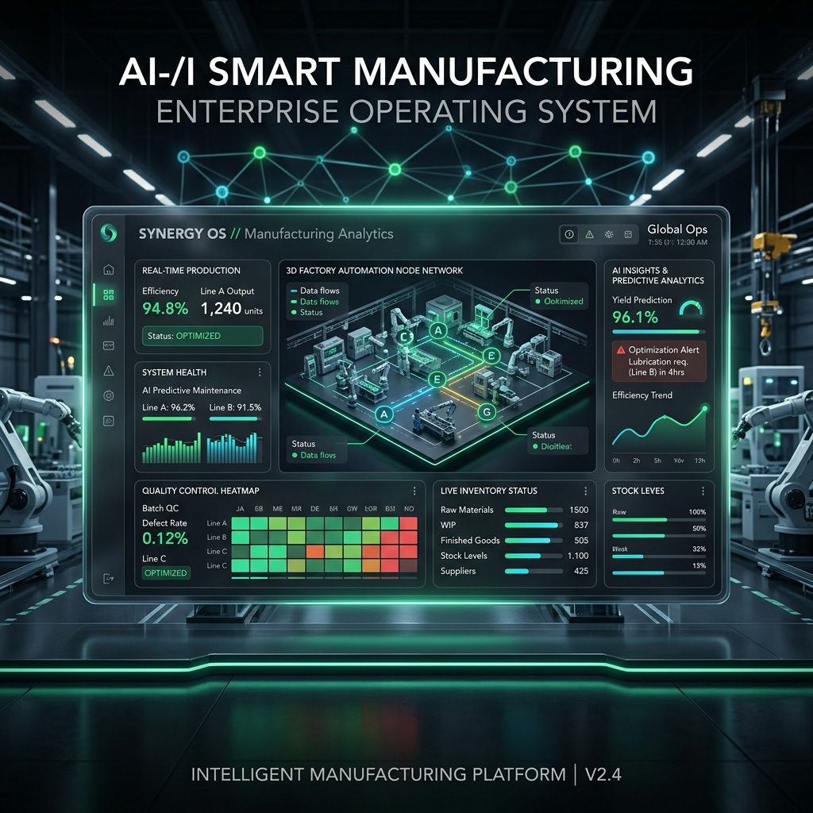
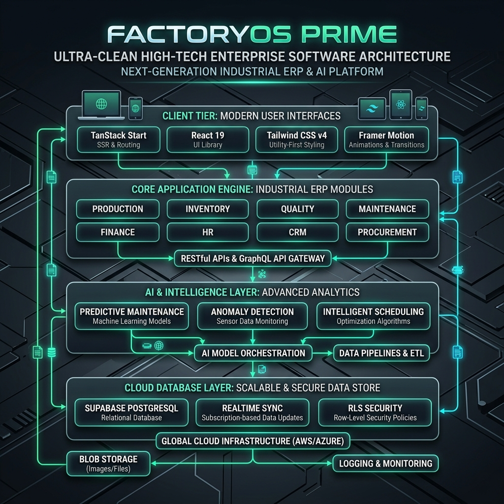

# 🏭 Factory OS Prime — AI-Powered Smart Manufacturing Platforms

[](https://react.dev/)
[](https://tanstack.com/)
[](https://tailwindcss.com/)
[](https://vitejs.dev/)
[](https://supabase.com/)
[](https://opensource.org/licenses/MIT)

> **Factory OS Prime** is a next-generation, AI-driven Smart Manufacturing ERP and Manufacturing Execution System (MES) built for modern factories, multi-plant enterprises, and Industry 4.0 operations. It unifies production planning, shop-floor execution, warehouse inventory, quality control, maintenance analytics, financial accounting, human resources, and AI-powered predictive intelligence into a single cohesive operating system.

---

## 🌟 Visual Showcase

### 📊 System Overview & Smart Dashboard



---

## 🚀 Key Modules & System Capabilities

Factory OS Prime is architected with modular enterprise micro-modules, allowing seamlessly integrated workflows across every manufacturing department:

| Module                            | Core Features & Functionality                                                                                             | Key Entities Managed                                      |
| :-------------------------------- | :------------------------------------------------------------------------------------------------------------------------ | :-------------------------------------------------------- |
| **🏭 Production & Execution**     | Work Order Lifecycle, Bill of Materials (BOM), Capacity Planning, Production Logs, Plant Overview, Shop-floor Dispatching | Work Orders, BOM Items, Stations, Shift Logs              |
| **📦 Inventory & Warehouse**      | Multi-Warehouse Stock Tracking, Goods Receipts, Stock Movements, Cycle Counting, Transfers, Spare Parts Catalog           | Inventory Items, Batches, Warehouses, Bin Locations       |
| **🛡️ Quality Assurance (QA/QC)**  | Incoming Inspection, In-Process Quality Checks, Final Inspection, Defect Logging, Non-Conformance Reports (NCR), CAPAs     | Inspections, Defects, CAPA Actions, Standards             |
| **🔧 Maintenance & Telemetry**    | Equipment Health Monitoring, Breakdown Management, Scheduled Maintenance Work Orders, Machine History                     | Machines, Telemetry Logs, Spare Parts, Maintenance Orders |
| **💰 Finance & Accounting**       | General Ledger, AP/AR, Customer & Supplier Invoices, Expense Tracking, Profit & Loss Statements, Budgets                  | Invoices, Expenses, Payments, Budgets, Taxes              |
| **👥 HR & Workforce Management**  | Employee Directory, Attendance Tracking, Leave Management, Payroll Engine, Recruitment Pipelines, Performance & Training  | Employees, Leaves, Payroll Items, Departments             |
| **🛒 Procurement & Supply Chain** | Supplier Directory, RFQ Processing, Vendor Performance Scoring, Purchase Orders, Supplier Invoices                        | Suppliers, RFQs, Purchase Orders, Ratings                 |
| **🤝 CRM & Sales**                | Customer Management, Quotations, Sales Orders, Approved Order Dispatch, Shipment Tracking                                 | Customers, Sales Orders, Shipments, Requests              |
| **🤖 AI Center & Intelligence**   | Machine Learning Uptime Prediction, Anomaly Detection, Intelligent Automated Scheduling, Production Analytics             | AI Models, Sensor Feeds, Alert Metrics                    |

---

## 🏗️ System Architecture

Factory OS Prime uses a modern, high-performance web architecture combining Server-Side Rendering (SSR), Client-Side Hydration, and Realtime Cloud Database synchronization.



### Technology Stack & Technical Highlights

- **Frontend Framework**: [React 19](https://react.dev/) + [TanStack Start](https://tanstack.com/router) with Vite 8 for SSR & route-level code splitting.
- **Styling & Motion**: Tailwind CSS v4 with modern CSS variables, OKLCH color spaces, glassmorphism, and [Framer Motion](https://www.framer.com/motion/) micro-interactions.
- **UI Components & Icons**: Radix UI primitives, [Lucide React](https://lucide.dev/) icons, [Recharts](https://recharts.org/) data visualizations, and Sonner notifications.
- **Data Layer & Realtime Backend**: [Supabase PostgreSQL](https://supabase.com/) with Row-Level Security (RLS), real-time database subscriptions, and secure API gateways.
- **Form Handling & Validation**: React Hook Form coupled with [Zod](https://zod.dev/) schema enforcements.

---

## 🔐 Role-Based Access Control (RBAC)

Factory OS Prime features a comprehensive 15-role security model grouped into four administrative tiers:

```
┌─────────────────────────────────────────────────────────────────────────────┐
│                             RBAC TIER MATRIX                                │
├──────────────────┬──────────────────┬──────────────────┬────────────────────┤
│  Platform Admin  │  Company Admin   │ Operations Team  │ External & Audit   │
├──────────────────┼──────────────────┼──────────────────┼────────────────────┤
│ Root Super Admin │ Company Admin    │ Plant Manager    │ Customer Portal    │
│                  │ Plant Admin      │ Prod Manager     │ Supplier Portal    │
│                  │                  │ Warehouse Mgr    │ Compliance Auditor │
│                  │                  │ Quality Inspect  │                    │
│                  │                  │ Maint Engineer   │                    │
│                  │                  │ Finance Manager  │                    │
│                  │                  │ HR Manager       │                    │
│                  │                  │ Shop Operator    │                    │
└──────────────────┴──────────────────┴──────────────────┴────────────────────┘
```

---

## 🛠️ Getting Started

### Prerequisites

- **Node.js**: v18.0.0 or higher
- **Package Manager**: `npm` (v9+) or `bun` (v1+)
- **Database**: Active [Supabase](https://supabase.com/) project

### Quick Setup

1. **Clone the Repository**

   ```bash
   git clone https://github.com/your-org/factory-os-prime.git
   cd factory-os-prime
   ```

2. **Install Dependencies**

   ```bash
   npm install
   ```

3. **Configure Environment Variables**
   Create a `.env` file in the project root:

   ```bash
   cp .env.example .env
   ```

   Fill in your Supabase credentials:

   ```env
   VITE_SUPABASE_URL=https://your-project.supabase.co
   VITE_SUPABASE_PUBLISHABLE_KEY=your-anon-key
   SUPABASE_URL=https://your-project.supabase.co
   SUPABASE_PUBLISHABLE_KEY=your-anon-key
   SUPABASE_SERVICE_ROLE_KEY=your-service-role-key
   ```

4. **Launch Development Server**

   ```bash
   npm run dev
   ```

   Open `http://localhost:8080` (or the port specified in terminal output) to view the application.

5. **Build for Production**
   ```bash
   npm run build
   ```
   To test the production build locally:
   ```bash
   npm run preview
   ```

---

## ⚙️ Environment Variables Reference

| Environment Variable            | Required | Description                                                    | Scope           |
| :------------------------------ | :------: | :------------------------------------------------------------- | :-------------- |
| `VITE_SUPABASE_URL`             |   Yes    | Supabase Project URL                                           | Client & Server |
| `VITE_SUPABASE_PUBLISHABLE_KEY` |   Yes    | Supabase Anonymous Public API Key                              | Client & Server |
| `SUPABASE_URL`                  |   Yes    | Supabase Project API URL                                       | SSR Server      |
| `SUPABASE_PUBLISHABLE_KEY`      |   Yes    | Supabase Public Key                                            | SSR Server      |
| `SUPABASE_SERVICE_ROLE_KEY`     |  Yes 🔒  | Supabase Service Role Key (Bypasses RLS for SSR Admin actions) | SSR Server Only |
| `VITE_SUPABASE_PROJECT_ID`      | Optional | Supabase Project Identifier                                    | Client          |

> ⚠️ **Security Warning**: `SUPABASE_SERVICE_ROLE_KEY` grants full administrative database access. Never expose this key in public client-side code repositories or client browser bundles.

---

## 🌐 Deployment (Vercel)

Factory OS Prime is optimized for zero-config deployment on **Vercel** via Nitro server presets:

1. Push your repository to GitHub / GitLab.
2. Import the project into your **Vercel Dashboard**.
3. Set the required Environment Variables (`SUPABASE_URL`, `SUPABASE_PUBLISHABLE_KEY`, `SUPABASE_SERVICE_ROLE_KEY`, `VITE_SUPABASE_URL`, `VITE_SUPABASE_PUBLISHABLE_KEY`).
4. Click **Deploy**. Vercel will automatically build the app with `vite build` and output to `.output/public`.

For detailed Vercel troubleshooting, see [VERCEL_SETUP.md](./VERCEL_SETUP.md).

---

## 📁 Repository Structure

```
factory-os-prime/
├── public/
│   ├── favicon.ico
│   └── images/
│       ├── hero-banner.png
│       └── architecture.png
├── src/
│   ├── components/       # Reusable UI primitives & module components
│   ├── hooks/            # Custom React hooks (useTheme, useAuth, etc.)
│   ├── integrations/     # Supabase client & API integrations
│   ├── lib/              # Utility functions, role mappings, formatters
│   ├── routes/           # TanStack Start file-based routing tree
│   │   ├── _authenticated/ # 88+ Role-protected module routes
│   │   ├── auth.tsx       # Auth login & demo role selection
│   │   └── index.tsx      # Landing page & platform overview
│   └── styles.css        # Tailwind v4 custom styles & OKLCH color tokens
├── supabase/             # Database migrations, policies & seed scripts
├── VERCEL_SETUP.md       # Vercel deployment documentation
├── package.json
└── vite.config.ts
```

---

## 📄 License

This project is licensed under the **MIT License** — see the [LICENSE](LICENSE) file for details.

Developed by OG NISHANT SHAH for Next-Gen Manufacturing Operations.
